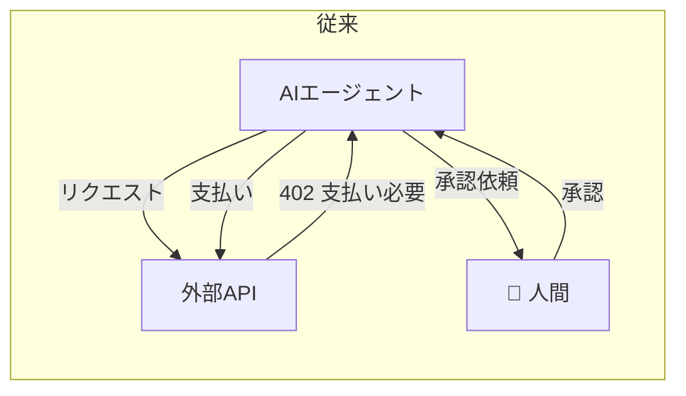
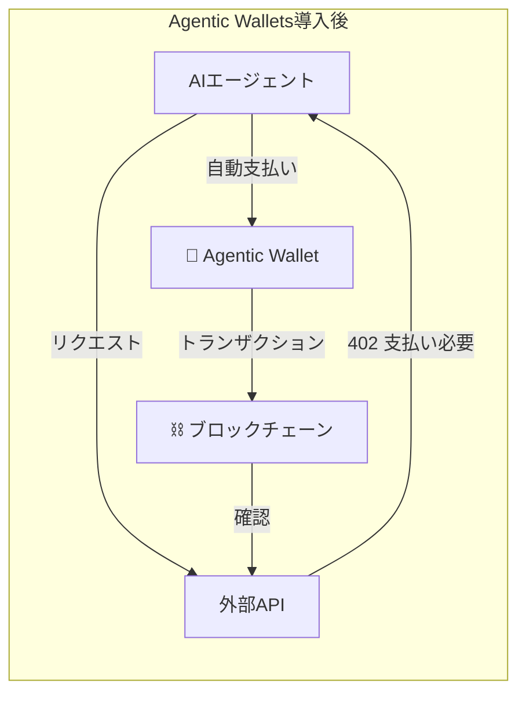
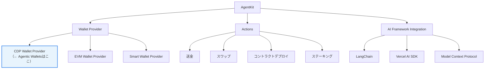
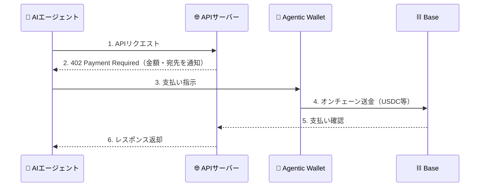
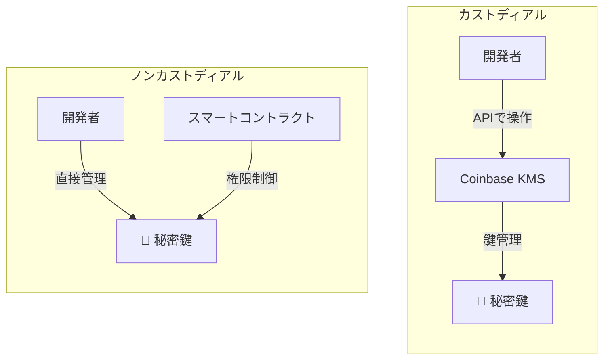
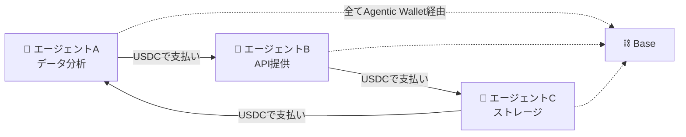

こんにちは！ブロックチェーン×AI Agentで自律経済圏を創るKomlock labでエンジニアをしている小原です。

2026年2月11日、Coinbaseが **Agentic Wallets** をローンチしました。

これは、AIエージェントが人間の介入なしに暗号資産を「保有し、送金し、取引する」ためのウォレット基盤です。

CoinbaseのCEO Brian Armstrong氏もこうポストしています。

https://x.com/brian_armstrong/status/1889024753651745139

「AIがお金を扱う」と聞くとSFっぽく聞こえるかもしれませんが、すでにx402プロトコルは5,000万件以上のトランザクションを処理しています。これは現実に動き始めている技術です。

この記事では、Agentic Walletsの仕組みと背景、そしてエンジニアとして「これが何を意味するのか」を整理してみます。

## 想定読者

- ブロックチェーン × AIの動向に興味があるエンジニア
- CoinbaseのAgentKitやCDPに触れてみたい人
- AIエージェントが「お金を扱う」とはどういうことか知りたい人

## そもそもなぜAIエージェントにウォレットが必要なのか

AIエージェントの進化は目覚ましいですよね。コードを書く、調査する、文章を生成する——いまやAIが「タスクを実行する」のは当たり前になりました。

しかし、ひとつ大きな壁がありました。

**AIは「お金を動かす」ことができなかった。**

AIエージェントに「APIの利用料を自動で支払ってほしい」「DeFiで運用してほしい」と頼みたくても、従来のエージェントには財布がありません。毎回人間が承認するか、事前に資金をデポジットしておく必要がありました。

以下の図を見てください。従来のAIエージェントと、Agentic Wallets導入後の違いです。

人間のボトルネックがなくなり、エージェントが自律的に動けるようになります。

## Agentic Walletsの全体像

Agentic Walletsは、Coinbase Developer Platform（CDP）上に構築されたAIエージェント向けのウォレット基盤です。

### 主な特徴

| 特徴 | 詳細 |
| --- | --- |
| **自律的な取引** | AIエージェントが人間の承認なしに送金・取引を実行 |
| **Cloud KMS** | 秘密鍵はCoinbaseのHSM（Hardware Security Module）で管理 |
| **ガス抽象化** | エージェントがガス代を意識せずにトランザクションを送信可能 |
| **プログラマブルな支出制限** | エージェントの支出に上限を設定できる |
| **x402プロトコル対応** | HTTPリクエストに支払いを組み込むプロトコルとネイティブ統合 |

### AgentKitの中での位置づけ

Agentic Walletsは、Coinbaseが2024年11月に公開した **AgentKit** フレームワークの拡張です。

全体の構成を図で見てみましょう。

AgentKitが「AIエージェントにブロックチェーンの手足を与える」フレームワークで、Agentic Walletsはその中の「財布」を担当しています。

## x402プロトコルとは

Agentic Walletsを理解する上で欠かせないのが **x402プロトコル** です。

名前の由来はHTTPステータスコードの `402 Payment Required`。HTTPリクエストに「支払い」を組み込むプロトコルです。

この一連の流れが、人間の介入なしに完結します。

x402は2026年2月時点で **5,000万件以上のトランザクション** を処理しており、決済大手のStripeとの連携も進んでいます。

:::message
以前、x402をPolygon MainnetのJPYCで動かす検証記事を書きました。Facilitatorの実装方法に興味がある方はぜひ👇
https://zenn.dev/komlock_lab/articles/d4cc55a2ecf543
:::

## カストディアル vs ノンカストディアル

Agentic Walletsを評価する上で避けて通れないのが、**カストディ（秘密鍵の管理方法）** の問題です。

### Coinbase Agentic Wallets（カストディアル）

CoinbaseのKMSが秘密鍵を管理するモデルです。開発者は鍵管理を気にしなくていい反面、Coinbaseへの信頼が前提になります。コンプライアンス・KYCフックが組み込み済みなので、エンタープライズ用途に強いです。

### ノンカストディアル（例：Agent Wallet SDK）

スマートコントラクトで権限を管理するモデル（ERC-6551 + ERC-4337）です。秘密鍵は第三者に預けず、支出制限もオンチェーンで強制されます。Coinbaseに依存しない代わりに、セットアップの手間がかかります。

| 観点 | Coinbase Agentic Wallets | ノンカストディアル |
| --- | --- | --- |
| セットアップ速度 | 速い（すぐ使える） | やや手間がかかる |
| 鍵管理 | Coinbaseに委託 | 自己管理 |
| 信頼モデル | Coinbaseを信頼 | コードを信頼 |
| カスタマイズ性 | CDP内で制限あり | 自由度高い |
| エンタープライズ対応 | 強い | これから |

どちらが優れているという話ではなく、ユースケースによって使い分けるべきだと思います。素早くプロトタイプを作りたいならCoinbase、自己主権を重視するならノンカストディアルが適しています。

## これが意味すること

Agentic Walletsの登場は、単に「AIエージェントがお金を使えるようになった」という話ではないと思っています。

### エージェント経済圏の本格始動

AIエージェント同士がサービスを提供し合い、自律的に決済する世界。これがようやく技術的に可能になりました。

### 「API課金」の再定義

x402によって、従来のAPIキー＋月額課金モデルから「リクエストごとのマイクロペイメント」に移行する可能性があります。これはAIエージェントとの相性が非常に良い。

### セキュリティの新しい課題

AIエージェントが自律的にお金を動かすということは、そのエージェントがハッキングされた場合のリスクも大きいということです。実際、BDICが「AgentCover Pro」というAIエージェント向け保険を発表しています。エージェント経済圏には、新しいリスク管理レイヤーが必要です。

### ブロックチェーンの存在意義が明確に

AIエージェント間の取引において、「信頼できる第三者なしに価値を移転できる」ブロックチェーンの特性は、まさに本質的な価値を発揮します。銀行口座を持てないAIエージェントにとって、ブロックチェーンは唯一の金融インフラです。

## まとめ

Coinbase Agentic Walletsは、AIエージェントに「財布」を持たせるための本格的なインフラです。

- **AgentKit** のフレームワーク上に構築
- **x402プロトコル** で自律的な決済を実現（5,000万件以上の実績）
- カストディアルモデルで開発体験を最優先
- エージェント経済圏の基盤インフラとして機能

個人的には、以前検証したx402の延長線上にある技術なので、今後はAgentic WalletsとAgentKitを使って実際にAIエージェントを動かす検証もやってみたいと思っています。

ブロックチェーン × AIエージェントの領域は、2026年に入ってからさらに加速している印象です。引き続きキャッチアップしていきます。

## 参考リンク

- [Coinbase AgentKit ドキュメント](https://docs.cdp.coinbase.com/agent-kit/welcome)
- [AgentKit GitHub](https://github.com/coinbase/agentkit)
- [Coinbase Agentic Wallets ローンチ記事](https://coinpaprika.com/news/coinbase-agentic-wallets-ai-agents-february-2026-launch/)
- [x402 + JPYC Facilitator検証記事（筆者）](https://zenn.dev/komlock_lab/articles/d4cc55a2ecf543)
