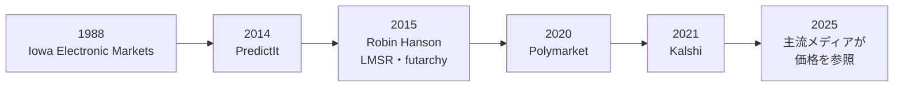

# 予測市場はPolymarketから始まったわけではない

予測市場という言葉が広く認知されるようになったのは、Polymarket や Kalshi の存在が大きいですよね。ただその起源はずっと古くて、少なくとも20世紀後半の学術・制度研究にまでさかのぼります。

予測市場は最初から巨大な商業サービスとして生まれたわけじゃありません。むしろ「市場メカニズムを使えば、未来に関する情報をうまく集約できるのではないか」という知的関心から始まって、学術実験、研究目的の制度、限定的な商用展開を経て、ようやく今の形にたどり着いたわけです。

# Iowa Electronic Markets

代表的な初期事例が Iowa Electronic Markets です。

IEM は、選挙や経済指標などを対象とした少額の研究・教育目的の市場として知られています。「実際に資金を伴う予測市場を継続運営して、その精度を観察した」という意味で非常に重要な存在でした。

# PredictIt のような研究目的市場

その後、PredictIt のように研究や限定的な制度的枠組みの中で運営される政治予測市場が登場します。これらは今日の本格的な商業予測市場に比べると規模も制約も大きいですが、予測市場の社会実装に向けた橋渡し役を果たしました。

# Robin Hanson と市場設計

予測市場の歴史を語るうえで、Robin Hanson を外すことはできません。

Hanson は予測市場を単なるベット市場じゃなくて、情報集約制度として深く理論化しました。特に market scoring rule や futarchy に関する議論は、「どのように設計されれば、少ない流動性でも情報をうまく吸い上げられるか」という点に大きな影響を与えたんです。

# ブロックチェーン時代の転換

予測市場に大きな転機をもたらしたのがブロックチェーンです。

オンチェーンでトークンを発行・移転できるようになると、予測市場の契約そのものを資産として扱いやすくなりました。結果トークンを条件付きで分割して、プログラム可能な形で保有・売買・決済できるようになったことで、予測市場は一気に「開発可能な金融インフラ」に近づいたんですよね。

# 規制市場としてのKalshi

他方で、同じ時代に別の方向から伸びてきたのが Kalshi です。

Kalshi はオンチェーンじゃなくて、規制市場として予測市場を制度の中に位置づけようとしました。これによって予測市場は、「暗号資産まわりの実験」ではなく「金融市場の一類型」として正面から制度と向き合うことになります。

# 2025年以降の局面

2025年以降、予測市場は明らかに新しい段階に入りました。

大統領選、利下げ、地政学、スポーツなど社会的関心の高いテーマで、予測市場の価格がメディアやSNSで頻繁に参照されるようになって、制度との衝突も可視化されています。

個人的にはこの流れが今後どう展開していくのか、引き続きウォッチしていきたいと思っています。

## 参考URL

- Iowa Electronic Markets  
  https://iem.uiowa.edu/
- CFTC Press Release 7047-14  
  https://www.cftc.gov/PressRoom/PressReleases/7047-14
- PredictIt: What is PredictIt?  
  https://www.predictit.org/support/what-is-predictit
- Robin Hanson paper  
  https://mason.gmu.edu/~rhanson/mktscore.pdf
