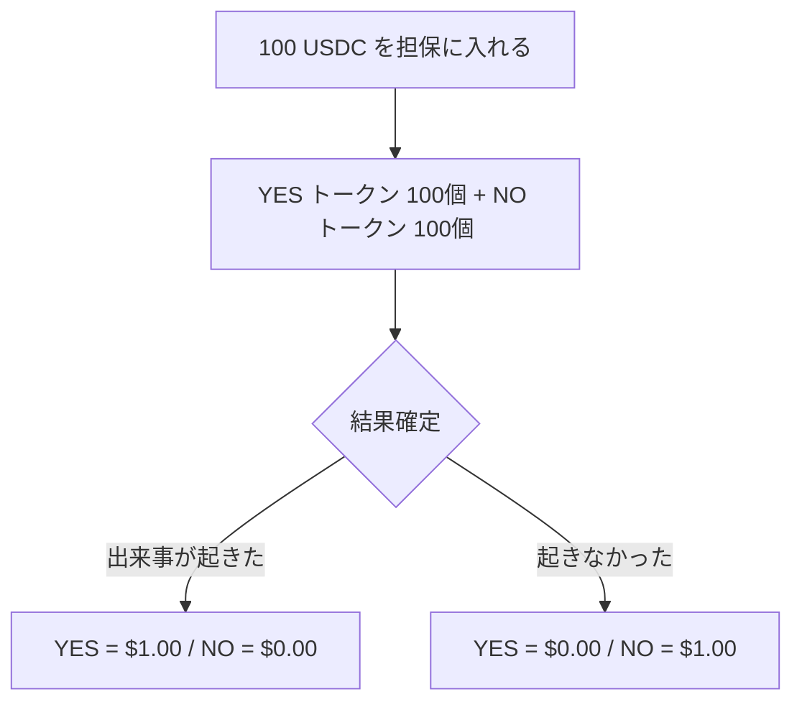

# 二値契約

予測市場の最も基本的な形は、二値契約です。

ある出来事が起これば 1、起こらなければ 0 で決済される契約を作って、その価格を市場で売買します。

YES 契約の価格が 0.42 ドルなら、その出来事の発生確率を市場が 42% 程度と見ていると解釈できるわけです。

# 満期と途中売買

予測市場は満期まで待って初めて意味を持つわけじゃありません。

ニュースが出て確率が変わったと思えば、参加者はポジションを追加したり手仕舞ったりします。こうして価格が継続的に更新されることで、予測市場は「一回の賭け」じゃなくて「継続的な価格発見の場」になります。

# 流動性の重要性

板が薄い市場では、ほんの少額でも価格が大きく動きます。するとその価格は確率というより、たまたま最後に約定した数字にすぎなくなります。

逆に十分な参加者と流動性があれば、価格は一人のノイズでは動きにくくなって、より安定したシグナルになります。この違いは結構大きいと思います。

# 解決条件

予測市場でもっとも軽視されがちで、実はもっとも重要なのが解決条件です。

「年内に停戦するか」という市場があったとして、何をもって停戦とするのか。正式な条約か、暫定合意か、宣言だけでよいのか。どの情報源を正とするのか。

この定義が曖昧だと、満期時に大きな紛争が起きます。技術的にどれだけ洗練された市場を作っても、解決条件が不明確だと信頼性が崩れます。

実際、2026年にはKalshiがイラン最高指導者の死亡に関する予測市場を巡って訴訟を起こされました。「死亡」の定義、情報源の信頼性、そもそもこのような市場を作ること自体の是非が問題になっています。解決条件の設計は技術的な問題であると同時に、倫理的・法的な問題でもあるわけです。

*Polymarketの個別市場（2026年3月時点）*

:::message alert
解決条件の曖昧さは予測市場の最大のリスク要因の一つです。ポジションを取る前に、必ず解決条件を確認することをおすすめします。
:::

Polymarketの注文板の仕組み
https://docs.polymarket.com/concepts/prices-orderbook

基本的な使い方
https://docs.polymarket.com/polymarket-101
