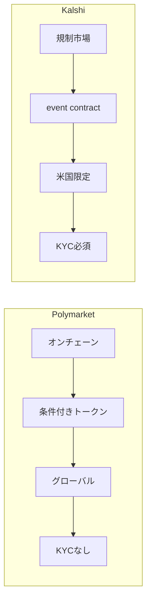

# Polymarket

Polymarket は、オンチェーン予測市場の代表格です。

条件付きトークン、ハイブリッドCLOB、オフチェーン注文とオンチェーン決済、開発者向けAPIなど、予測市場をブロックチェーンインフラとして構築しています。グローバルにアクセスできて、透明性が高くて、プログラム可能。ブロックチェーンの特性を最大限活かした設計になっているわけです。

# Kalshi

Kalshi は、規制市場型の代表です。

event contract を制度の中で運営している点に特徴があります。制度的正統性、監督、コンプライアンス、参加者保護の枠組みが強い一方、扱えるテーマに制約もあります。Polymarketとは真逆のアプローチで、制度を信頼の土台にしています。

# PredictIt

PredictIt は、学術・研究目的市場から現代の予測市場を考えるうえで重要な存在です。

現代の大規模プレイヤーほど技術的に派手じゃありませんが、予測市場が社会実装される過程を理解するうえで示唆的です。Iowa Electronic Marketsと並んで、予測市場の歴史を語る上で外せないプラットフォームだと思います。

# どう比較すべきか

主要プレイヤーを比較するときは、単に UX や出来高だけじゃなくて、次の軸で見ると整理しやすいです。

**信頼の源泉は何か**  
制度なのか、コードなのか、透明性なのか。

**売買メカニズムは何か**  
CLOB なのか、AMM なのか、market scoring rule なのか。

**決済はどう行うか**  
オンチェーンなのか、カストディアルなのか。

**解決は誰が担うか**  
オラクル、人間、コミュニティ、第三者機関。

**どの規制に服するか**  
CFTC監督下なのか、グレーゾーンなのか、規制外なのか。

**どんなテーマを扱えるか**  
政治、スポーツ、地政学、マクロ経済、すべてOKなのか制限ありなのか。

この観点で整理すると、同じ「予測市場」でも構造がかなり違うことがわかります。

各プレイヤーの詳細

Polymarket Documentation
https://docs.polymarket.com/

Kalshi Regulation FAQ
https://help.kalshi.com/en/articles/13823765-how-is-kalshi-regulated

PredictIt
https://www.predictit.org/
