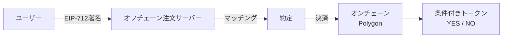
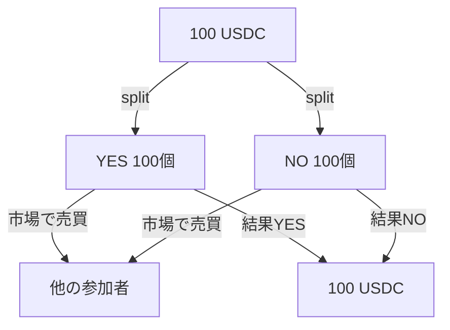

# Polymarketは何が新しかったのか

Polymarket の新しさは、予測市場を単なるWebアプリじゃなくて、ブロックチェーンインフラとして再構成したことにあります。

ユーザーは将来事象に関する市場でポジションを取って、そのポジションは条件付きトークンとして扱われます。

注文は署名ベースで出されて、マッチングと決済は分離される。この構造によって、予測市場は「ブラウザの中の賭け」じゃなくて「プログラム可能な資産市場」に近づいたんですよね。

# ハイブリッド構造

Polymarket は、完全オンチェーン order book ではなく、オフチェーン注文とオンチェーン決済を組み合わせたハイブリッド構造で理解するとわかりやすいです。

注文のマッチングはオフチェーンで高速に処理されて、約定した結果だけがオンチェーンで決済される。これによって取引の速度とコストを改善しつつ、最終的な資産の移転はブロックチェーン上で保証されるわけです。

# EIP-712署名

Polymarket を技術的に理解するうえでは、EIP-712 署名ベースの注文という視点が重要です。

ユーザーはウォレットで注文内容に署名して、その署名をオフチェーンのオーダーブックサーバーに送ります。サーバーは署名を検証してマッチングを行い、約定したらオンチェーンで決済する。この仕組みによって、ガス代を払わずに注文を出せるようになっています。

# 条件付きトークン

Polymarket の核にあるのが、結果をトークン化するという発想です。

YES / NO の結果ポジションを条件付きトークンとして扱うことで、予測市場のポジションを明確なデジタル資産として表現できます。このトークンは売買できるし、プログラムで操作もできる。予測市場が「賭け」から「資産」になったと言えるかもしれません。

# CTF

Conditional Token Framework は、条件に応じて資産を分割・統合するための枠組みです。

予測市場では結果ごとのポジションを作る土台になります。たとえば100 USDCを担保にして、YES トークン100個と NO トークン100個に分割する。どちらかが1.0 USDCの価値を持つことになるので、合計すると必ず100 USDCに戻るわけです。

# オラクルと解決

どれだけ美しく売買できても、最終結果をどう判定するかが曖昧なら市場は成立しません。

Polymarketでは、解決者（resolver）が結果を確定させます。この部分は完全に分散化されているわけじゃなくて、信頼できる情報源をベースに人間が判断するケースが多い。取引の分散性と、解決の信頼性は別問題なんですよね。

# APIとデータ市場

Polymarket が開発者にとって面白いのは、予測市場がデータソースにもなっていることです。

価格、出来高、約定、オッズ変化、マーケット一覧など、予測市場の情報はそのままアプリケーションの入力になります。この公開されたデータを使って、オッズ変動を監視したり、複数市場の相関を分析したりできるわけです。

Polymarketの技術詳細:

Trading Overview
https://docs.polymarket.com/trading/overview

CTF Overview
https://docs.polymarket.com/trading/ctf/overview

CLOB Introduction
https://docs.polymarket.com/developers/CLOB/introduction

Prices & Orderbook
https://docs.polymarket.com/concepts/prices-orderbook
