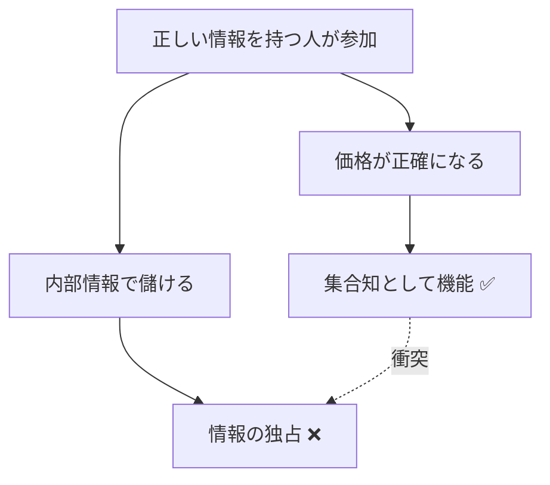

# 予測市場の最大の矛盾

予測市場の最大の矛盾は、とてもシンプルです。

正しい情報を持つ人ほど儲かる。

これは予測市場の強みでもあり、最も危うい点でもあります。市場が正確になるのは、情報優位を持つ参加者が売買に参加するからです。でもその情報が公開情報じゃなくて内部情報だった場合、市場の精度向上と市場の公正性が衝突するんですよね。

# インサイダー問題

株式市場では、重要な非公開情報を使って売買する行為は厳しく規制されます。

予測市場でも同じような問題は起こりますが、対象が企業業績だけじゃなくて、政策、地政学、軍事、選挙、組織内部、メディア発表などに広がるぶん、むしろ扱いはさらに難しくなります。

「利下げ確率」の市場で、FRB関係者が取引したらどうするのか。「選挙結果」の市場で、陣営スタッフが取引したら。こういった線引きは簡単じゃありません。

# 精度と公平性の衝突

内部情報が入ると価格は当たりやすくなるかもしれない。でもその中身は集合知じゃなくて、情報優位者による収益化かもしれません。

予測市場が「正確な予測」を求めるなら、情報を持つ人の参加を歓迎すべきです。でも「公正な市場」を求めるなら、内部情報の利用は排除すべき。この2つは簡単には両立しないんです。

# 操作と板の薄さ

流動性が十分でない市場では、少額の取引でも価格を動かしやすくなります。

価格が真実を表しているというより、価格が話題を作ってしまう危険があります。「この市場で確率が急上昇した」というニュースが流れて、それがさらに注目を集めて価格が動く。こういったフィードバックループが起きやすいんですよね。

# 解決ルールの紛争

予測市場は未来予測の場であると同時に、契約解釈の場でもあります。

どのソースを正とするのか、条件を満たしたと言えるのか、例外事象をどう扱うのか。これらが曖昧だと満期時に揉めます。技術的にどれだけ優れた市場を作っても、解決ルールが不明確だと最後に信頼が崩れるんです。

# 倫理の問題

戦争、テロ、死亡、暗殺、災害、病気、犯罪など「市場化してよい出来事とは何か」という倫理問題が常につきまといます。

情報価値があるからといって、すべてを市場化していいわけじゃない。でも逆に「不謹慎だから禁止」だけで片づけると、予測市場の可能性そのものが狭まってしまう。このバランスは難しいと思います。

:::message alert
2026年3月時点で、Kalshiはイラン最高指導者に関する予測市場を巡って訴訟を受けています。倫理問題は理論上の議論ではなく、現在進行形の課題です。
https://www.reuters.com/world/middle-east/kalshi-sued-over-ouster-iran-leader-prediction-market-2026-03-06/
:::

:::message
CFTCは2026年2月に予測市場に対するAdvisoryを発表し（https://www.cftc.gov/PressRoom/PressReleases/9185-26）、インサイダー取引を含む不正行為への取り締まり姿勢を明確にしています。
:::
